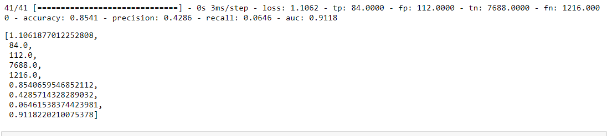

# Wine - Testing

## Mission objectives

- [x] Use a deep learning library
- [x] Prepare a data set for a machine learning model
- [x] Put together a simple neural network
- [x] Tune parameters of a neural network
  
## The Process

As asked, we first created a model without modifying any data.

And got some result to see what we could get without any effort :

### Some observations :

- accuracy is high but it's expected since our datas are highly imbalanced
- true positive is 0 confirming that we can't, now, evaluate our model only based on his accuracy metric.

### Modifying the set

[A little read about vine](https://www.extension.iastate.edu/wine/total-sulfur-dioxide-why-it-matters-too#:~:text=Simply%20put%2C%20Total%20Sulfur%20Dioxide,aldehydes%2C%20pigments%2C%20or%20sugars.) convice me to add a column.

and then i normalize the rest of the set.

__This is the result after two trains with modified datas ::__

### Adding class weight threw sklearn into our model

Since our datas are skewed,a few methods opened up to me(Upsamble,Downsample,SMOTE,...). I went with the class-weight approach. With this argument the model learn how to deal with certains un or sur represented classes.